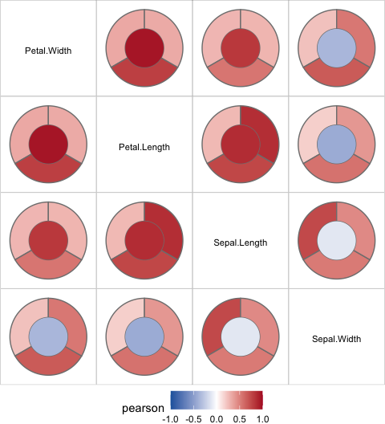
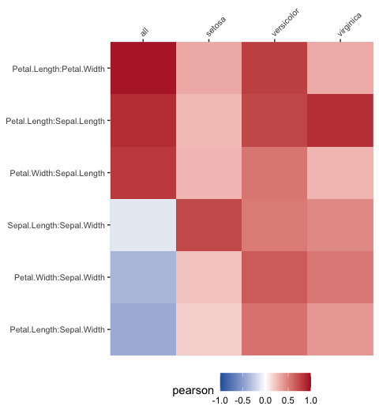

<!-- README.md is generated from README.Rmd. Please edit that file -->

# bullseye

<!-- badges: start -->
<!-- badges: end -->

The goal of bullseye is to provide a tidy data structure and
visualisations for multiple or grouped variable correlations, general
association measures and other pairwise scores suitable for numerical,
ordinal and nominal variables.

## Installation

You can install the development version of bullseye from
[GitHub](https://github.com/) with:

``` r
# still in progress
# install.packages("devtools")
# devtools::install_github("cbhurley/bullseye")
```

## Build a `pairwise` data structure

``` r
library(bullseye)
irisc <- pairwise_scores(iris, by = "Species") 
irisc
#> # A tibble: 24 × 6
#>    x            y            score   group      value pair_type
#>    <chr>        <chr>        <chr>   <fct>      <dbl> <chr>    
#>  1 Petal.Length Sepal.Length pearson setosa     0.267 nn       
#>  2 Petal.Width  Sepal.Length pearson setosa     0.278 nn       
#>  3 Sepal.Length Sepal.Width  pearson setosa     0.743 nn       
#>  4 Petal.Length Sepal.Width  pearson setosa     0.178 nn       
#>  5 Petal.Width  Sepal.Width  pearson setosa     0.233 nn       
#>  6 Petal.Length Petal.Width  pearson setosa     0.332 nn       
#>  7 Petal.Length Sepal.Length pearson versicolor 0.754 nn       
#>  8 Petal.Width  Sepal.Length pearson versicolor 0.546 nn       
#>  9 Sepal.Length Sepal.Width  pearson versicolor 0.526 nn       
#> 10 Petal.Length Sepal.Width  pearson versicolor 0.561 nn       
#> # ℹ 14 more rows
```

This calculates correlations for every level of species in the data.

For other methods for calculating pairwise variable scores see the
vignette “Calculating pairwise scores using bullseye”.

## Visualise the correlations

``` r
plot_pairwise(irisc)
```

<!-- -->

The glyph shows the overall or ungrouped correlation in the center, and
the grouped correlations in the wedges. These are setosa, versicolor,
virginica starting from the top and going anti-clockwise. Use

``` r
plot_pairwise(irisc, interactive=TRUE)
```

to see the groups represented by the wedges. The ungrouped Pearson
correlation of Sepal.Width with the other three variables is negative,
but the correlations for each of the Species is positive.

A second visualisation is offered also:

``` r
plot_pairwise_linear(irisc)
```

<!-- -->

For more visualisation examples see the vignette “Visualising pairwise
scores using bullseye”.
