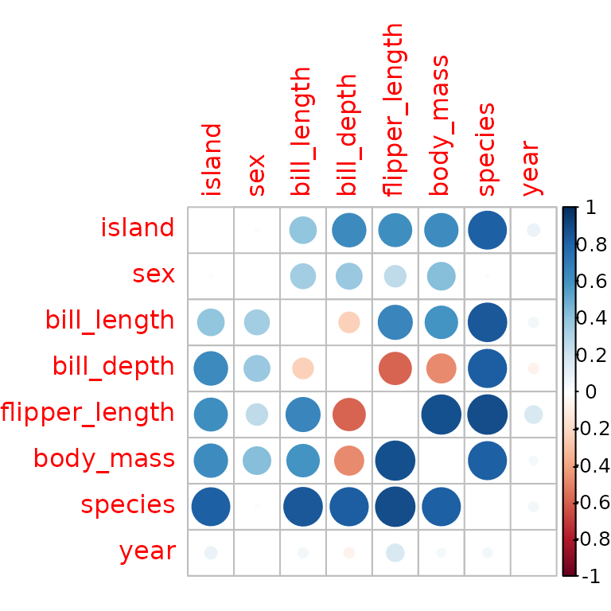
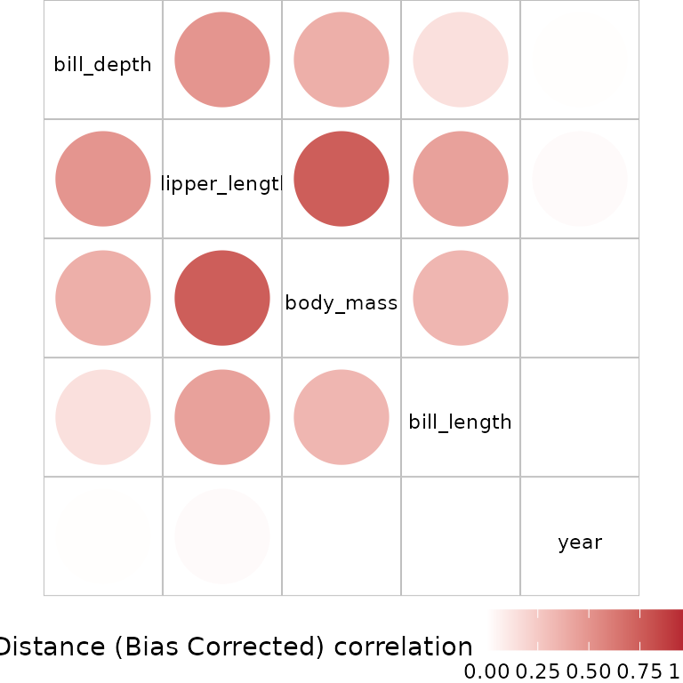
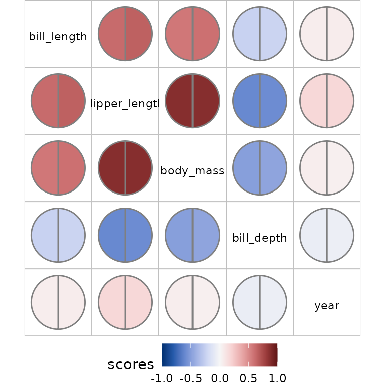
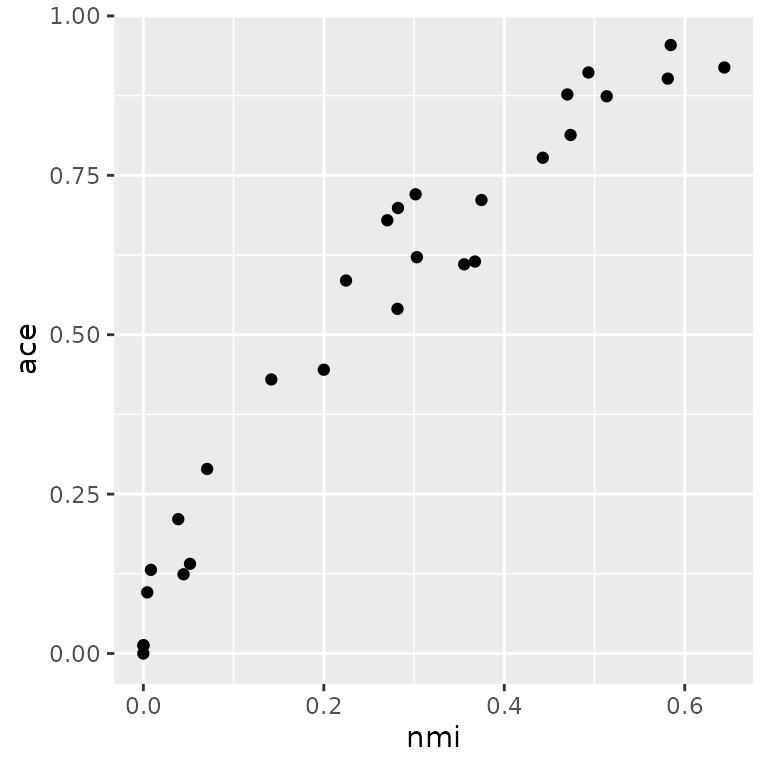

# Integrating bullseye with other packages.

There are many other packages for visualising correlation or similar
information. Here we show how `pairwise` structures produced by
`bullseye` can be displayed with these visualisations provided by these
packages.

Conversely, we show how correlation or correlation-like information
provided by other packages can be displayed using `bullseye`.

``` r
# install.packages("palmerpenguins")

library(bullseye)
library(dplyr)
library(ggplot2)
peng <-
  rename(palmerpenguins::penguins, 
           bill_length=bill_length_mm,
           bill_depth=bill_depth_mm,
           flipper_length=flipper_length_mm,
           body_mass=body_mass_g)
```

## Using data structures from `bullseye` with other packages

### `corrplot` visualisations

The package `corrplot` provides correlation displays in matrix layout.
Standard usage builds a correlation matrix with `cor` and plots it with
`corrplot`.

To show `bullseye` results:

``` r
sc <- pairwise_scores(peng) # includes factors, unlike `cor`
  
corrplot::corrplot(as.matrix(sc), diag=FALSE)
```



``` r
# corrplot::corrplot(as.matrix(sc, default=1)) # to show 1 along the diagoonal
```

### `linkspotter` visualisations

The `linkspotter` package calculates and visualizes association for
numeric and factor variables using a network layout plot. The nodes show
the variables and the edges represent the measure of association between
pair of variables. Absolute correlation is mapped to edge width.

``` r
linkspotter::linkspotterGraphOnMatrix(as.data.frame(as.matrix(sc)),minCor=0.7)
```

## Using `bullseye` visualisations with other packages.

The `correlation` package offers calculation of a variety of
correlations, including partial correlations, Bayesian correlations,
multilevel correlations, polychoric correlations, biweight, percentage
bend or Sheperd’s Pi correlations, distance correlation and more. The
output data structure is a tidy dataframe with a correlation value and
correlation tests for variable pairs for which the correlation method is
defined. This is converted to `pairwise` via the `as.pairwise` method.

``` r
# install.packages("correlation")
library(correlation)
sc_cor <- correlation(peng, method = "distance")
plot(as.pairwise(sc_cor))
```



Multiple measures from `correlation` can also be used:

``` r
sc_multi<- bind_rows(
  as.pairwise(correlation(peng, method = "pearson")),
  as.pairwise(correlation(peng, method = "biweight")))
plot(sc_multi)
```



## Using other visualisations with `bullseye` results.

In this example we compare ace and nmi measures for the penguin data

``` r
pm <- pairwise_multi(peng)
tidyr::pivot_wider(pm, names_from=score, values_from = value) |>
  ggplot(aes(x=nmi, y=ace))+ geom_point()
```


