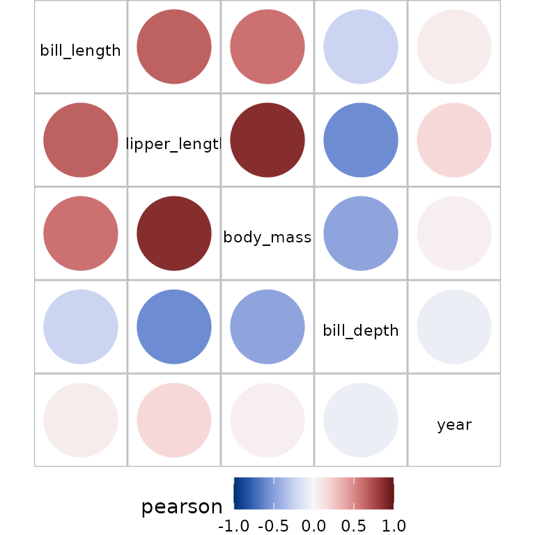
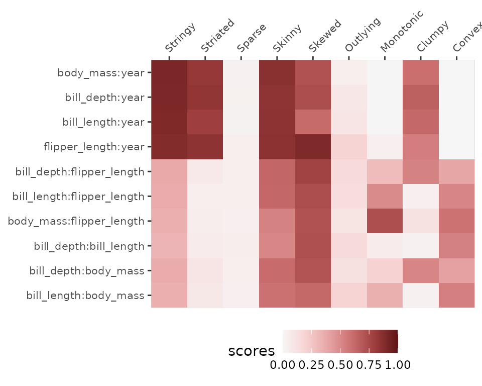
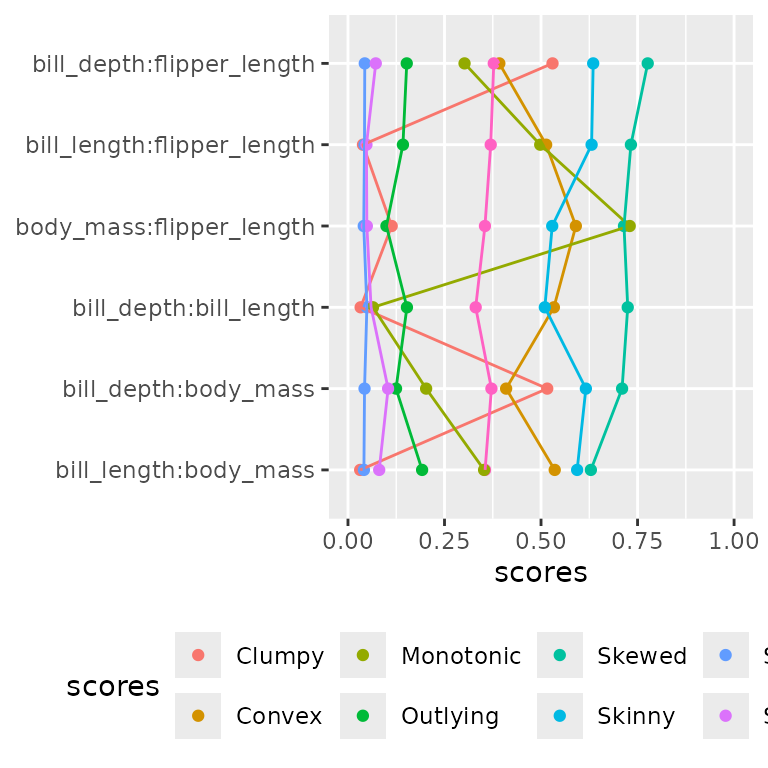
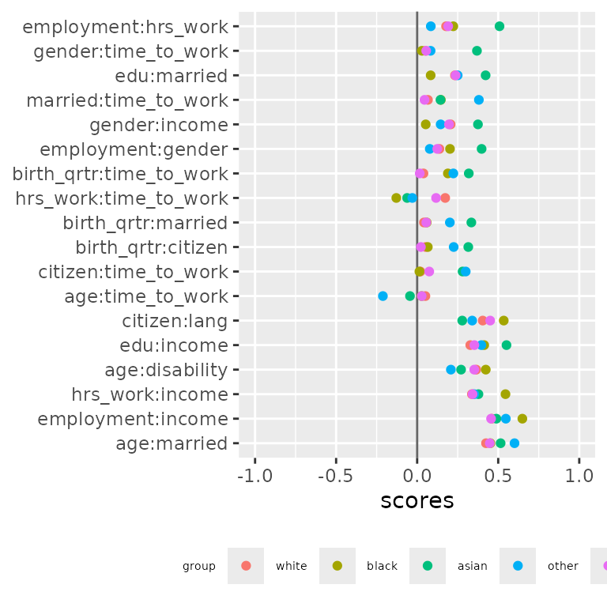
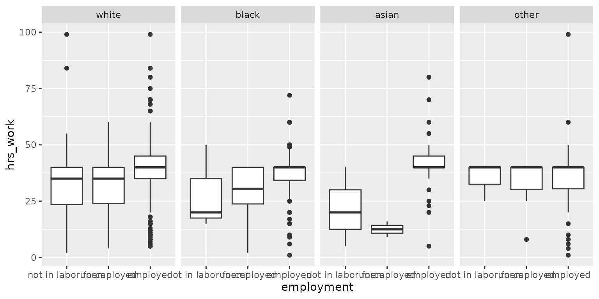
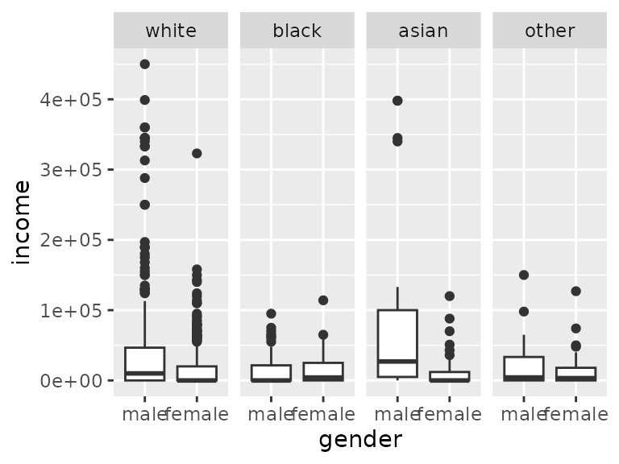

# Visualising pairwise scores using bullseye.

`bullseye` is an R package which calculates measures of association and
other scores for pairs of variables in a dataset and helps in
visualising these measures in different layouts. The package also
calculates and visualises the pairwise measures for different levels of
a grouping variable.

This vignette gives an overview of how these pairwise variable measures
are visualised. Calculation details are given in the accompanying
vignette.

``` r
# install.packages("palmerpenguins")

library(bullseye)
library(dplyr)
library(ggplot2)
peng <-
  rename(palmerpenguins::penguins, 
           bill_length=bill_length_mm,
           bill_depth=bill_depth_mm,
           flipper_length=flipper_length_mm,
           body_mass=body_mass_g)
```

## Visualising associations

The usual starting point is the visualisation of a correlation of
numeric variables:

``` r
plot(pair_cor(peng))
```



If you wish to also include factor variables, use an alternative to
`pair_cor` which accepts numeric and factor variables, eg `pair_cancor`.
To see the available methods which handle all variable types use

``` r
filter(pair_methods,nn&ff&fn)
#> # A tibble: 3 × 7
#>   name        nn    ff    fn    from                range ordinal
#>   <chr>       <lgl> <lgl> <lgl> <chr>               <chr> <lgl>  
#> 1 pair_ace    TRUE  TRUE  TRUE  acepack::ace        [0,1] FALSE  
#> 2 pair_cancor TRUE  TRUE  TRUE  cancor              [0,1] FALSE  
#> 3 pair_nmi    TRUE  TRUE  TRUE  linkspotter::maxNMI [0,1] FALSE
```

Alternatively, if you wish to show different association measures for
correlation for numeric variables and cancor for non numeric, plot the
result of `pairwise_scores`:

``` r
plot(pairwise_scores(peng), interactive=TRUE)
```

Adding `interactive=TRUE` means tooltips are available.

By default variables in this plot are re-ordered to emphasize pairs with
maximum absolute scores. This re-ordering uses hierarchical clustering
to place high score pairs adjacently, and also to push high score pairs
to the top-left of the display.

## Visualising multiple scores

The `pairwise` structure has multiple association scores when each (x,y)
pair appears multiple times in the pairwise structure.

``` r
scores <- pairwise_scores(peng, by="species")
plot(scores, interactive=TRUE) 
```

The bullseye plot shown here has a pie wedge representing the
conditional correlations. The overall or ungrouped correlation is shown
in the pie center. As there are multiple scores for each (x,y) pair the
ordering algorithm is based on the maximum of these scores.

An alternative ordering algorithm gives emphasis to pairs with the
largest difference in the scores:

``` r
plot(scores, var_order="seriate_max_diff", interactive=TRUE) 
```

Pairs of numeric variables exhibit Simpsons paradox if the ungrouped
correlation is negative and the grouped corelations are positive (or
vice-versa). This is present for the pairs (body_mass_mm, bill_depth_mm)
and (bill_depth_mm, bill_length_mm).

The island variable is also associated with the penguin dimension
variables. However, this is mostly because two of the species (Gentoo
and Chinstrap) are located on one island only. For these species, the
score values for island and the other variables is NA, shown in grey.

If the pairwise structure has the additional column `n` for the number
of observations in each score calculation, the bullseye plot has slices
in proportion to `n`. In this display we see there are far fewer
Chinstraps than Gentoos or Adelies.

``` r
pairwise_scores(peng, by="species", add.nobs = TRUE)|>
  plot(interactive=TRUE) 
```

Multiple pairwise scores also occur when `pairwise` data structures are
combined:

``` r
mscores <- 
bind_rows(
  pair_cor(peng),
  pair_cor(peng, method="spearman"),
  pair_dcor(peng),
  pair_ace(peng)
) |> filter(pair_type=="nn") |>
  mutate(value=abs(value)) # convert all scores to 0-1

plot(mscores, interactive=TRUE) 
```

In this case the various measures of association are fairly consistent.
For the `bill_depth` variable the ace correlations are higher than the
others, indicating the presence of a non-linear association.

## Visualising multiple scagnostic scores

``` r
sc <- pair_scagnostics(peng)
plot(sc, interactive=TRUE)
```

With many scores for example with scagnostics, an alternative display is
perhaps easier to read.

So we offer an alternative plot of the `pairwise` structure:

``` r
plot(sc, type="linear", geom="tile")
```



The default ordering arranges the variable pairs in order of their
maximum score. Here all the high-scoring pairs involve year, which is
not surprising as year takes just three distinct values.

``` r
sc |> filter(y != "year")|>
plot(type="linear", geom="point", add_lines=TRUE)
```



According to the scagnostic measures, all pairwise scatterplots exhibit
skewness, and body_mass:flipper_length scores highly on the outlier
measure.

## Linear display for filtered pairwise objects

We use the American Community Survey (2012) from the R package
`openintro` which contains results from the US Census American Community
Survey in 2012.

| Variable     | Description                                                                                                              |
|:-------------|:-------------------------------------------------------------------------------------------------------------------------|
| income       | Annual income                                                                                                            |
| employment   | Employment status with categories not in labor force, unemployed, employed                                               |
| hrs_work     | Hours worked per week                                                                                                    |
| race         | Race of the participant with categories white, black, asian or other                                                     |
| age          | Age of the participant in years                                                                                          |
| gender       | Gender with categories male or female                                                                                    |
| citizen      | Whether the person is a U.S. citizen                                                                                     |
| time_to_work | Travel time to work, in minutes                                                                                          |
| lang         | Language spoken at home with categories english or other                                                                 |
| married      | Whether the person is married                                                                                            |
| edu          | Education level with categories hs or lower, college, grad                                                               |
| disability   | Whether the person is disabled                                                                                           |
| birth_qrtr   | The quarter of the year that the person was born with categories jan thru mar, apr thru jun , jul thru sep, oct thru dec |

Variable description of the acs12 dataset

``` r
acs12 <- openintro::acs12

scores <- pairwise_multi(acs12)
```

The `scores` contains various pairwise measures for the 78 variable
pairs. Note that the calculation of correlations for the variables
(employment, time_to_work) gives NA, because all observations that have
a non missing time_to_work have employment=employed.

``` r
filter(scores, x=="employment", y=="time_to_work")
#> # A tibble: 3 × 6
#>   x          y            score  group value pair_type
#>   <chr>      <chr>        <chr>  <chr> <dbl> <chr>    
#> 1 employment time_to_work ace    all      NA fn       
#> 2 employment time_to_work cancor all      NA fn       
#> 3 employment time_to_work nmi    all      NA fn
```

Many of the scores will be low, so we pick out the pairs with a score of
.25 or above to display:

``` r
mutate(scores, valmax = max(abs(value)), .by=c(x,y))|> 
  filter(valmax > .25) |> 
  plot(type="linear",geom="point", interactive=TRUE)
```

employment:income has the highest score, measured using `ace`,
suggesting a higher association for transformed `income`.

The `ace_cor` function calls
[`acepack::ace`](https://rdrr.io/pkg/acepack/man/ace.html) (handling
factors and missing) and shows that ace picks a transformation that
compresses high income values.

``` r
a <- ace_cor(acs12$income, acs12$employment)
plot(a$x, a$tx)
```

Similarly `age:income` has a high ace score, and a plot of these two
variables shows income goes up with age until about age 40 and then
drops off.

Next, we calculate scores by race and filter those x,y pairs with high
values and high differences:

``` r
group_scores <- pairwise_scores(acs12, by = "race")

# filtering variable pairs with a range of 0.25 or greater

mutate(group_scores, valrange = diff(range(value)),valmax = max(abs(value)), .by=c(x,y))|> 
  filter(valrange > .25 | valmax > .4) |>
  plot(type="linear", geom="point", pair_order = "seriate_max_diff")+ 
   theme(legend.text = element_text(size = rel(.5)), legend.title = element_text(size = rel(.5))
  )
```



Asians have much higher association than other groups for many of the
variables. Employed Asians report much higher hours worked:

``` r
ggplot(data=acs12, aes(x=employment, y=hrs_work))+
  geom_boxplot()+
  facet_grid(cols=vars(race)) +scale_x_discrete(na.translate = FALSE)
```



For Asians, there is a big difference in travel time to work for genders
compared to other races.

``` r
ggplot(data=acs12, aes(x=gender, y=time_to_work))+
  geom_boxplot()+
  facet_grid(cols=vars(race)) 
```



For Asians, there is a big difference in income across genders compared
to other races.

``` r
ggplot(data=acs12, aes(x=gender, y=income))+
  geom_boxplot()+
  facet_grid(cols=vars(race))
```


So Asians work more than other groups, but Asian women commute less and
earn less.
